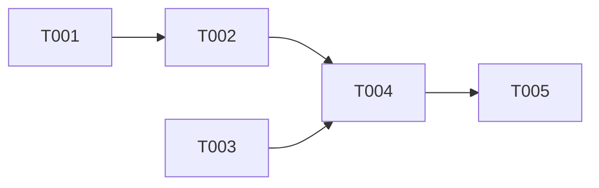

# Task: Generate Task Breakdown for {{.inputs.feature_id}}

## Prerequisites

Read the following inputs:
- Implementation plan: `.specify/implementation/{{.inputs.feature_id}}/plan.md`
- Feature spec: From GitHub issue (provided in context)
- Constitution: `.specify/memory/constitution.md`

## Task Format (Strict)

Each task follows this exact format:

```
- [ ] T001 [P] [US1] Description with file path
       │     │    │
       │     │    └── User Story label (US1, US2...)
       │     └────── [P] if parallelizable with other tasks
       └──────────── Sequential ID (T001, T002...)
```

## Task Organization

### Phase 1: Setup
Tasks that prepare the project structure. No user story labels.

```markdown
- [ ] T001 Create directory structure for feature
- [ ] T002 Add placeholder files
```

### Phase 2: Foundational
Core abstractions required by all user stories. No user story labels.

```markdown
- [ ] T003 [P] Define domain entity in internal/domain/workflow/entity.go
- [ ] T004 [P] Define port interface in internal/domain/ports/repository.go
```

### Phase 3-N: User Stories (one phase per story)
Implementation tasks grouped by user story, in P1 → P2 → P3 order.

```markdown
## Phase 3: User Story 1 (P1 - Must Have)

- [ ] T005 [US1] Implement repository adapter in internal/infrastructure/
- [ ] T006 [US1] Implement application service in internal/application/
- [ ] T007 [US1] Add CLI command in internal/interfaces/cli/
- [ ] T008 [P] [US1] Write unit tests for repository
- [ ] T009 [P] [US1] Write unit tests for service

## Phase 4: User Story 2 (P2 - Should Have)

- [ ] T010 [US2] Extend entity with new field
- [ ] T011 [US2] Update service for new behavior
```

### Final Phase: Polish
Cross-cutting concerns, integration tests, documentation.

```markdown
## Phase N: Polish

- [ ] T0XX Write integration tests in tests/integration/
- [ ] T0XX Update README with new feature
- [ ] T0XX Add feature tag comment to test files
```

## Rules

1. **Each task must be self-contained**: Enough context for an LLM to complete without questions
2. **Include file paths**: Every task specifies which file(s) to create/modify
3. **Dependency order**: Tasks within a phase can be parallelized, phases are sequential
4. **Test after implementation**: Tests come after their implementation tasks
5. **Max 20 tasks per feature**: Break down further if exceeding
6. **Constitution compliance**: Tasks should reference principles where applicable

## Task Description Guidelines

Good:
```
- [ ] T005 [US1] Implement YAMLRepository in internal/infrastructure/yaml/repository.go
- [ ] T006 [US1] Add Load() method to WorkflowService in internal/application/workflow.go
```

Bad:
```
- [ ] T005 [US1] Implement repository  # Too vague, no file path
- [ ] T006 Write some tests           # Missing user story, vague
```

## Output Format

Output markdown with the task breakdown:

```markdown
# Tasks: {{.inputs.feature_id}}

## Summary
- Total tasks: N
- User stories covered: US1, US2
- Estimated parallelizable: M tasks

## Phase 1: Setup

- [ ] T001 ...

## Phase 2: Foundational

- [ ] T002 [P] ...
- [ ] T003 [P] ...

## Phase 3: User Story 1 (P1)

- [ ] T004 [US1] ...
- [ ] T005 [US1] ...

## Phase 4: User Story 2 (P2)

- [ ] T006 [US2] ...

## Final Phase: Polish

- [ ] T0XX ...

## Dependencies



## Execution Notes

- Tasks marked [P] can run in parallel within their phase
- Run `make lint` after each implementation task
- Run `make test-unit` after test tasks
```

**Output ONLY the markdown, no explanations.**
